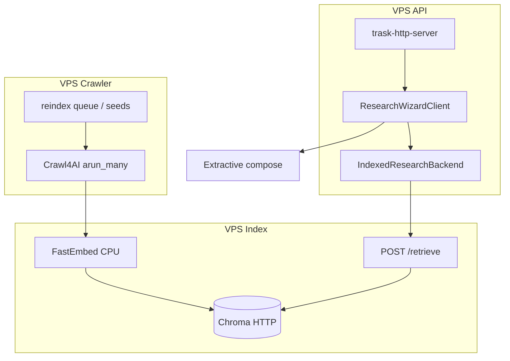

# Trask Crawl4AI + Chroma CPU RAG Migration

## Living plan status

**Authority split:** This plan owns **indexer + crawl + VPS**. Product behavior for **Discord auto-index, grounded compose, question-last** is in `docs/brainstorms/trask-rag-discord-compose-requirements.md` (supersedes this plan’s stale “no LLM on compose” assumption).

### Delta update (2026-05-19)

- **Landed:** `infra/trask-indexer/` (Chroma, FastEmbed, `POST /retrieve`, Crawl4AI crawl module); GPTR removed; `scripts/trask_web_research.py` (retrieve → `passages`, `index_miss`, DDG only with `TRASK_WEB_RESEARCH_DDG_FALLBACK`); golden fixture seed (`scripts/smoke_trask_indexed_stack.py --golden-fixtures`, `scripts/trask_index_seed_for_qa.sh`); grounded compose default-on via `loadResearchWizardRuntimeConfig` (`groundedComposeEnabled`, `composeMode`); `research-compose.ts` helpers; no `searchLocalKnowledge` merge on compose path; rewrite opt-in (`TRASK_RESEARCH_COMPOSE_MODE=rewrite`); `scripts/trask_discord_sync.py` multi-guild + freshness file; CI seeds Chroma and starts `trask-indexer serve` before `pnpm holocron:e2e`; `data/trask-eval/golden-queries.json`.
- **Partial:** Web corpus background reindex worker not scheduled on VPS; Discord sync **off** unless `TRASK_DISCORD_SYNC_INTERVAL_MS` > 0; Holocron e2e requires fresh indexer after seed (restart if Chroma was cleared while indexer was running); `ResearchBackend` / `TRASK_RESEARCH_BACKEND` flag not implemented.
- **Next:** (1) Scheduled crawl/reindex worker on VPS; (2) production Discord sync interval + monitoring; (3) optional LLM keys in CI for richer compose (heuristic/offline path works without keys); (4) `FileChunkStore` ingest merge (deferred R-3/R-4).

## Summary

Replace legacy vendor research/OpenRouter research with a **spike-proven** self-hosted stack: Crawl4AI crawlers on VPS, FastEmbed (`BAAI/bge-small-en-v1.5`) on CPU, Chroma for hybrid retrieval, a Python `POST /retrieve` service, and a Node `ResearchBackend` port with extractive cited answers. Holocron HTTP and e2e contracts stay unchanged until the indexed backend passes the five golden queries.

---

## Problem Frame

Holocron and Discord depend on an opaque legacy vendor research subprocess, vendor LLM routing, and citation padding. The product still needs tool-grade KOTOR answers with verifiable `https://` citations—but the research engine must become **owned crawl → chunk → embed → index → retrieve → cite**, without GPU or paid embedding APIs. (see origin: [docs/brainstorms/trask-crawl4ai-rag-requirements.md](docs/brainstorms/trask-crawl4ai-rag-requirements.md))

**Plan-specific framing:** Crawl4AI/Chroma **spike code exists** under `infra/trask-indexer/`; remaining work is **production wiring** (scheduled crawl, e2e gate, demote DDG/rewrite paths). Compose authority follows `trask-rag-discord-compose-requirements.md` (temp-0 LLM extract + compose, not extractive-only Node).

---

## Assumptions

- **Chroma** on a dedicated VPS with HTTP API; **FastEmbed** `BAAI/bge-small-en-v1.5` as default embed model (upgrade only if golden-query recall fails).
- **Python retrieve service** (REST) on indexer VPS; Node `IndexedResearchBackend` is an HTTP client.
- **v1 compose** uses temp-0 LLM claim extract + compose (`grounded-evidence.ts`); embeddings stay on CPU FastEmbed in Python only.
- **Retrieve at Q&A** runs via `scripts/trask_web_research.py` → indexer HTTP; `TRASK_RESEARCH_BACKEND=indexed` remains optional future flag (not implemented).
- **Several VPS** with roles: crawl, embed/index (may co-locate embed+Chroma), API (`trask-http-server`).
- Proactive Discord embeddings (`proactive-llm.ts`) deferred until indexed path is stable.

---

## Requirements

Trace to origin R-1–R-16 and success criteria.

**Origin actors:** Holocron user, Discord `/ask` user, operator, indexer workers

**Origin flows:** F1 background index, F2 Holocron question, F3 operator reindex

**Origin acceptance examples:** AE-1 … AE-5

- R1. Approved-host-only crawl and index (origin R-1, R-3)
- R2. Passage metadata: url, host, source_id, content_hash (R-2)
- R3. CPU free embeddings, pinned model (R-4, R-5)
- R4. Hybrid dense + lexical retrieval (R-6)
- R5. Chroma backups / ops (R-7, R-16)
- R6. Extractive compose + no citation padding (R-8, R-9, AE-2)
- R7. ≥2 https citations or abstain (R-10, R-11, AE-1)
- R8. Unchanged trask-http 202 + poll (R-12)
- R9. Discord/Holocron parity (R-13)
- R10. Five Holocron e2e queries pass on indexed backend (R-14, AE-1, AE-3)
- R11. VPS role separation documented (R-15)

---

## Scope Boundaries

- legacy vendor research/OpenRouter/Tavily on the **research/retrieve/embed** path
- Paid cloud embedding APIs
- GPU inference
- General open-web search on v1
- Holocron provenance UX polish before backend wins (defer to follow-up)
- Faithfulness CI (RAGAS) before baseline fixtures exist
- Replacing proactive embeddings in v1

### Deferred to Follow-Up Work

- Qdrant migration if Chroma hybrid proves awkward at scale
- Bounded live crawl (3–5 URLs) after index-only e2e passes
- Optional Ollama compose on VPS
- sqlite-vec snapshot deploy for edge API nodes
- Full removal of legacy vendor research Docker/CI until indexed path is production-default for 2+ weeks

---

## Context & Research

### Relevant code and patterns

- `packages/trask/src/research-wizard.ts` — citation policy, `ResearchWizardQueryHandler`, legacy vendor research path to replace
- `packages/trask/src/trask-research-subprocess.ts` — legacy vendor research-only; bypass for indexed
- `packages/trask-http/src/router.ts` — composition root unchanged if handler swapped
- `apps/trask-http-server/src/main.ts` — wire `ResearchBackend` + env
- `packages/retrieval/src/index.ts` — allowlist SoT (`traskApprovedResearchSources`, hosts, URL checks)
- `apps/ingest-worker/src/main.ts` — reindex queue + Firecrawl/raw fetch pattern to mirror for Crawl4AI jobs
- `apps/holocron-web/e2e/holocron-research.spec.ts` — mandatory gate

### Institutional learnings

- No `docs/solutions/` entries for this stack yet.

### External references

- Crawl4AI: https://docs.crawl4ai.com/
- FastEmbed: https://qdrant.github.io/fastembed/
- Chroma: https://docs.trychroma.com/
- Origin brainstorm: [docs/brainstorms/trask-crawl4ai-rag-requirements.md](docs/brainstorms/trask-crawl4ai-rag-requirements.md)
- Ideation (sequencing): [docs/ideation/2026-05-19-trask-grounded-qa-next-steps-ideation.md](docs/ideation/2026-05-19-trask-grounded-qa-next-steps-ideation.md)

### Repo / KB drift (must fix during execution)

- KB claims local chunks merge into `answerQuestion`; code does not — indexed path supersedes via retrieve, not legacy vendor research merge
- `docs/trask.md` timeout/PCGW lines vs `packages/retrieval/src/index.ts`
- `vendor/removed vendor research tree` empty until `git submodule update --init`

---

## Key Technical Decisions

| Decision | Rationale |
|----------|-----------|
| **Spike before monorepo wiring** | Greenfield stack; avoid 8-unit plan with no runnable crawl/index |
| **Chroma + FastEmbed bge-small-en-v1.5** | Free CPU ONNX; brainstorm default (see origin) |
| **Hybrid BM25 + dense in Chroma** | Tool names need lexical + semantic (R-6, AE-3) |
| **`ResearchBackend` + `TRASK_RESEARCH_BACKEND`** | legacy vendor research default until e2e green |
| **REST `/retrieve` on Python service** | Fits multi-VPS split |
| **Grounded compose in Node v1** | Temp-0 LLM on claims/compose only; no digest rewrite as default (see compose requirements doc) |
| **Reuse retrieval allowlist** | Single policy source; export catalog JSON for Python crawler seeds |
| **Pre-index golden corpus before cutover** | Success criterion 1 requires indexed e2e without live legacy vendor research |

---

## Open Questions

### Resolved during planning

| Question | Resolution |
|----------|------------|
| Chroma vs Qdrant v1? | **Chroma** |
| Subprocess JSON vs REST for retrieve? | **REST** on indexer VPS |
| When to remove legacy vendor research from CI? | After U7 + e2e green with flag; U9 removes from default deploy |

### Deferred to implementation

- Optimal chunk size (paragraph vs 512-token windows) after inspecting real Crawl4AI markdown
- Chroma hybrid API version pinning for BM25+dense fusion
- Whether ingest-worker switches from Firecrawl to Crawl4AI in-place vs separate `infra/trask-indexer`

---

## Output Structure

```text
infra/trask-indexer/
  pyproject.toml
  trask_indexer/
    crawl.py
    chunk.py
    embed.py
    chroma_store.py
    retrieve_api.py
    allowlist.py
  Dockerfile
  README.md
scripts/
  bootstrap_trask_indexer.sh
  smoke_trask_indexed_stack.py
  export_trask_allowlist_catalog.py
packages/trask/src/
  research-backend.ts
  indexed-research-backend.ts
  extractive-compose.ts
data/trask-eval/
  golden-queries.json
  baseline/   # optional legacy vendor research captures before cutover
```

---

## High-Level Technical Design

> Directional guidance for review, not implementation specification.



**Query sequence:** embed query → hybrid search (filtered by allowlist metadata) → optional CPU cross-encoder rerank on top-30 → evidence DTO → extractive answer + aligned Sources.

---

## Phased Delivery

### Phase 0 — Prove stack (do not skip)

### Phase 1 — Indexer + contracts

### Phase 2 — Node backend swap

### Phase 3 — Product cutover + ops

---

## Implementation Units

### Phase 0 — Prove stack

- U0. **VPS stack spike (Crawl4AI → Chroma → manual query)**

**Goal:** Prove the new engine can answer one golden question from real indexed text before any `packages/trask` refactor.

**Requirements:** R1, R2, R4, R5 (prototype only)

**Dependencies:** None

**Files:**
- Create: `infra/trask-indexer/` (minimal package layout)
- Create: `scripts/bootstrap_trask_indexer.sh`
- Create: `scripts/smoke_trask_indexed_stack.py`
- Create: `scripts/export_trask_allowlist_catalog.py` (JSON from `defaultSourceCatalog`)

**Approach:**
- Bootstrap Python venv: crawl4ai, fastembed, chromadb, uvicorn (or flask).
- Crawl **one** approved host (e.g. `kotor.neocities.org` or `deadlystream.com` TSLPatcher thread).
- Chunk markdown (~300–500 tokens, overlap); embed with `BAAI/bge-small-en-v1.5`; upsert Chroma collection `trask_dev`.
- CLI: query “What is TSLPatcher used for in KOTOR modding?” → print top-5 passages with URLs.
- Document VPS sizing (RAM for Chromium + embed batch).

**Execution note:** Run entirely on indexer VPS; no Node changes in this unit.

**Test scenarios:**
- Happy path: smoke script exits 0 with ≥3 passages containing TSLPatcher-related terms
- Edge case: empty crawl result → script fails loudly with host name
- Error path: Chroma unreachable → non-zero exit

**Verification:**
- Human-readable passages justify an answer; screenshot/log saved under `data/trask-eval/spike/`

---

### Phase 1 — Indexer service + retrieve API

- U1. **Indexer service scaffold and allowlist export**

**Goal:** Production-shaped Python service with approved seeds only.

**Requirements:** R1, R2, R15

**Dependencies:** U0

**Files:**
- Create: `infra/trask-indexer/` (full layout per Output Structure)
- Create: `infra/trask-indexer/Dockerfile`
- Create: `scripts/export_trask_allowlist_catalog.py`
- Test: `infra/trask-indexer/tests/test_allowlist.py` (if pytest added)

**Approach:**
- Load allowlist JSON exported from `@openkotor/retrieval` (hosts + url prefixes).
- Reject enqueue of non-approved URLs in crawler.
- Rate limit + `check_robots_txt` per Crawl4AI docs.

**Test scenarios:**
- Happy path: URL on approved host accepted
- Edge case: `pcgamingwiki.com` or off-list URL rejected
- Integration: export script includes all `traskApprovedResearchBaseHosts`

**Verification:**
- Docker image builds; `list-seeds` command prints catalog source count

---

- U2. **Chroma hybrid ingest and `POST /retrieve`**

**Goal:** R6, R7; deliver evidence contract for Node.

**Requirements:** R4, R5, R6, R7, AE-3

**Dependencies:** U1

**Files:**
- Modify: `infra/trask-indexer/trask_indexer/chroma_store.py`, `retrieve_api.py`, `embed.py`
- Test: `infra/trask-indexer/tests/test_retrieve.py`

**Approach:**
- Ingest: dense vectors via FastEmbed; parallel BM25/sparse via Chroma BM25 integration or app-level RRF of dense + lexical lists.
- `POST /retrieve` body: `{ query, sourcePreferences?, limit? }` → `{ passages: [{ id, url, host, quote, score, sourceId }] }`.
- Pin embed model version in config/env.

**Technical design:** RRF merge of two ranked lists (dense top-20, lexical top-20) → allowlist filter → return top-8 passages with excerpt text capped (~500 chars).

**Test scenarios:**
- Covers AE-3: query “MDLOps” returns passage containing MDLOps or model tooling terms
- Happy path: hybrid beats dense-only on exact token fixture (synthetic index in test)
- Error path: missing collection → HTTP 503 with JSON error

**Verification:**
- curl retrieve returns JSON passages for TSLPatcher query against dev index

---

- U3. **Reindex worker + queue integration**

**Goal:** F3, AE-4; operator workflow.

**Requirements:** R2, F3, AE-4

**Dependencies:** U1, U2

**Files:**
- Create: `infra/trask-indexer/trask_indexer/worker.py`
- Modify: `apps/ingest-worker/src/main.ts` (optional bridge: enqueue only) OR document parallel CLI `trask-indexer drain-queue`
- Modify: `docs/knowledgebase/50-execution/ingest-worker-cli-runbook.md`

**Approach:**
- Drain `reindex-queue.json` from shared `INGEST_STATE_DIR` (same contract as ingest-worker).
- Incremental upsert by `content_hash`; skip unchanged pages.
- Operator can run worker on indexer VPS against shared volume or S3-synced state dir.

**Test scenarios:**
- Happy path: reindex one source id increases passage count for a known URL
- Edge case: corrupt queue file handled per existing lock contract

**Verification:**
- After reindex, retrieve API returns new passages for a query tied to that source

---

### Phase 2 — Node `ResearchBackend`

- U4. **`ResearchBackend` port and config flag**

**Goal:** R12; safe parallel operation with legacy vendor research.

**Requirements:** R12, origin success criteria (flagged rollout)

**Dependencies:** U2 (retrieve API stable)

**Files:**
- Create: `packages/trask/src/research-backend.ts`
- Create: `packages/trask/src/indexed-research-backend.ts`
- Modify: `packages/trask/src/research-wizard.ts` (delegate or split legacy vendor research into `indexed-research-backend.ts`)
- Modify: `packages/trask/src/index.ts`
- Modify: `packages/config/src/index.ts`
- Test: `packages/trask/src/indexed-research-backend.test.ts`
- Test: `packages/config/src/index.test.ts`

**Approach:**
- `loadResearchWizardRuntimeConfig` adds `researchBackend: 'legacy' | 'indexed'`, `indexerBaseUrl`, `retrieveTimeoutMs`.
- `IndexedResearchBackend` implements `ResearchWizardQueryHandler`: maps progress phases (`gather`→retrieve, `sources`→passages, `compose`→extractive).
- `createResearchWizardClient` selects backend from config.

**Test scenarios:**
- Happy path: mock HTTP retrieve → `answerQuestion` returns answer + approvedSources
- Error path: retrieve 503 → degraded message, no fake citations (AE-5)
- Integration: router test mock swaps to `IndexedResearchBackend`

**Verification:**
- Unit tests pass; manual `TRASK_RESEARCH_BACKEND=indexed` + local trask-http against remote retrieve

---

- U5. **Extractive compose and citation alignment**

**Goal:** R8, R9, R10, R11; AE-1, AE-2.

**Requirements:** R8, R9, R10, R11, AE-1, AE-2

**Dependencies:** U4

**Files:**
- Create: `packages/trask/src/extractive-compose.ts`
- Modify: `packages/trask/src/research-wizard.ts` (remove padding behavior on indexed path)
- Test: `packages/trask/src/extractive-compose.test.ts`
- Test: `packages/trask/src/research-wizard.test.ts` (extend)

**Approach:**
- Build answer from evidence passages: bullets with `[n]`; quotes must be substrings of passage text.
- `approvedSources` = only URLs referenced in body (delete `ensureMinimumWebCitations` padding on indexed path).
- If &lt;2 independent hosts in cited passages → `sourceOnlyFallbackAnswer` pattern (existing).

**Execution note:** Test-first on `extractive-compose` pure functions.

**Test scenarios:**
- Covers AE-2: body without `[n]` → abstention, not padded Sources
- Covers AE-1: two citations from passages produce two Sources entries
- Edge case: conflicting quotes → caveat section (R-9 / AE-3 conflict variant in compose)

**Verification:**
- `splitResearchAnswer` + citation audit in `scripts/verify_trask_cli_qa.mjs` branch for indexed mode

---

### Phase 3 — Corpus, e2e, deploy

- U6. **Pre-index golden corpus**

**Goal:** Success criteria 1, 5; AE-1.

**Requirements:** R-14, AE-1, AE-3, AE-4

**Dependencies:** U2, U3

**Files:**
- Create: `data/trask-eval/golden-queries.json` (five e2e questions + expected fact patterns)
- Create: `scripts/trask_index_golden_corpus.sh` (crawl all approved base hosts, bounded depth)

**Approach:**
- Run indexer against full `traskApprovedResearchSources` (practical depth limits per host to avoid unbounded forums).
- Store Chroma backup snapshot on vector VPS.
- Optional: capture legacy vendor research baseline answers into `data/trask-eval/baseline/` before cutover for human comparison.

**Test scenarios:**
- Happy path: each golden query returns ≥2 passages from distinct hosts via retrieve API
- Edge case: missing host in index logged before e2e

**Verification:**
- Retrieve smoke for all five questions documented in `data/trask-eval/README.md`

---

- U7. **Wire hosts and Holocron e2e on indexed backend**

**Goal:** R12–R14; all success criteria.

**Requirements:** R12, R13, R14, AE-1–AE-5

**Dependencies:** U4, U5, U6

**Files:**
- Modify: `apps/trask-http-server/src/main.ts`
- Modify: `apps/trask-bot/src/main.ts` (same backend flag)
- Modify: `scripts/holocron-e2e-live-server.sh` (env for indexed + indexer URL)
- Modify: `apps/holocron-web/e2e/holocron-research.spec.ts` (optional: provenance strip later)
- Test: existing e2e (mandatory gate)

**Approach:**
- E2e server starts with `TRASK_RESEARCH_BACKEND=indexed`, `TRASK_INDEXER_BASE_URL=http://127.0.0.1:8xxx` (or CI service container).
- Discord keeps 90s SLA; tune retrieve timeout accordingly.

**Verification:**
- `pnpm holocron:e2e` passes all five queries with indexed backend
- `pnpm verify:trask-cli` passes in indexed mode

---

- U8. **CI, Docker, and legacy vendor research decommission path**

**Goal:** R15, R16; remove false legacy vendor research dependency for indexed deploys.

**Requirements:** ops, R16

**Dependencies:** U7

**Files:**
- Modify: `.github/workflows/ci.yml` (Chroma/indexer service for e2e job OR documented self-hosted runner)
- Modify: `infra/trask-http-public/Dockerfile` (drop legacy vendor research bootstrap when indexed default)
- Modify: `.github/workflows/trask-http-public.yml`
- Modify: `scripts/pack-trask-http-hf-context.sh`
- Modify: `docs/knowledgebase/50-execution/trask-configuration-env-map.md`
- Modify: `docs/knowledgebase/10-architecture-runtime/trask-synthesis-and-chunk-retrieval.md`
- Modify: `AGENTS.md` (Holocron verification for indexed stack)

**Approach:**
- CI: start Chroma + indexer container before e2e; or split e2e to indexed-only workflow with secrets for crawl disabled (prebuilt index artifact).
- HF Docker: Node-only image when `TRASK_RESEARCH_BACKEND=indexed`; keep legacy vendor research path behind flag until removal milestone.
- Document backup/restore for Chroma data directory.

**Test scenarios:**
- Integration: CI job fails if retrieve service not reachable
- Test expectation: none for pure doc edits — reason: documentation alignment

**Verification:**
- CI green on PR with indexed backend; legacy vendor research smoke optional on `main` until flag flip

---

- U9. **CLI verification and operator runbook**

**Goal:** Operator clarity; R15.

**Requirements:** F3, success criteria 4

**Dependencies:** U3, U7

**Files:**
- Modify: `scripts/verify_trask_cli_qa.mjs`
- Create: `docs/knowledgebase/50-execution/trask-indexed-stack-runbook.md`
- Modify: `docs/trask.md` (research backend section)

**Approach:**
- Document VPS layout, env vars, backup, reindex, health checks.
- CLI verifies citation alignment (body `[n]` vs Sources).

**Verification:**
- New runbook reviewed against actual `infra/trask-indexer` commands

---

## System-Wide Impact

- **Interaction graph:** `trask-http` router, Discord bot, Pazaak Trask mount, CF `trask-worker` proxy unchanged at HTTP layer; upstream must expose indexed `trask-http-server`.
- **Error propagation:** Retrieve failures surface as `Research failed` / `sourceOnly`—never legacy vendor research-style narrative stubs on indexed path.
- **State lifecycle risks:** Partial Chroma writes during crawl; use content_hash idempotency; queue lock unchanged.
- **API surface parity:** `ResearchWizardQueryHandler` preserved; `listModels` may return static `indexed` profile.
- **Unchanged invariants:** Thread poll, anonymous `persistQueries`, allowlist host policy, MIN 2 https citations for Holocron.
- **Proactive mode:** Still uses OpenAI embeddings until follow-up; document as known gap.

---

## Risks & Dependencies

| Risk | Mitigation |
|------|------------|
| Empty `vendor/removed vendor research tree` blocks legacy vendor research baseline | Capture baseline before cutover optional; spike does not need legacy vendor research |
| Forum crawl unbounded | Per-host URL caps + sitemap seeds only |
| Chroma SPOF | Nightly backup; export snapshot to object storage |
| Crawler OOM (Chromium) | Dedicated VPS; separate from Chroma |
| E2e flaky without index artifact | Prebuilt Chroma snapshot in CI artifact |
| PCGamingWiki in e2e regex but not crawlable | Narrow e2e source patterns or manual seed (see archaeologist note) |
| Discord 90s timeout | Retrieve-only budget; no live crawl on Discord v1 |

**Prerequisites:** VPS access, Docker on indexer VPS, Playwright deps for Crawl4AI, shared `INGEST_STATE_DIR` or equivalent queue volume.

---

## Documentation / Operational Notes

- New runbook: `docs/knowledgebase/50-execution/trask-indexed-stack-runbook.md`
- Update `trask-configuration-env-map.md` with `TRASK_RESEARCH_BACKEND`, `TRASK_INDEXER_BASE_URL`, embed model version
- Fix KB drift: `trask-synthesis-and-chunk-retrieval.md` local-merge claims
- AGENTS.md: Holocron verification must include indexed stack bootstrap, not only legacy vendor research
- Add `docs/solutions/` entry after U7 passes

---

## Alternative Approaches Considered

| Approach | Why not v1 |
|----------|------------|
| **Refactor legacy vendor research grounding only** | User mandate: abandon legacy vendor research/OpenRouter for research |
| **Qdrant instead of Chroma** | Valid; defer until Chroma hybrid proves insufficient |
| **sqlite-vec on API node** | Good latency; defer until after central index works |
| **Embed in Node via ONNX runtime** | Crawl4AI is Python-native; split is cleaner |
| **Skip spike, start at U4** | High risk; ideation proved spike is gating |

---

## Success Metrics

1. Five Holocron e2e queries pass with `TRASK_RESEARCH_BACKEND=indexed`.
2. Retrieve path makes zero calls to OpenAI/OpenRouter/legacy vendor research.
3. Median ask latency within Holocron client timeout on production VPS sizing.
4. Operator reindex changes retrieve results for a targeted source (AE-4).
5. Human rubric on 10 toolchain questions beats optional legacy vendor research baseline captures.

---

### Delta Update (2026-05-19)

- **Landed:** Indexed compose cutover, Holocron e2e + `verify:trask-cli` green on golden fixtures; Discord early-defer hardening (`discord-ask-interaction.ts`); `STRATEGY.md`; plan `2026-05-19-002-fix-trask-discord-ask-respond`.
- **Partial:** Live Discord `/ask` in production requires always-on `trask-bot` process (local bot starts OK); channel allowlist must match snowflake from `trask_discord_channel_verify.mjs`.
- **Next:** Keep `pnpm dev:trask` or container running on OldRepublicDevs; confirm `TRASK_APPROVED_CHANNEL_IDS` for `#discord-bot-testing`; optional hosted deploy manifest for trask-bot.

---

## Sources & References

- **Origin document:** [docs/brainstorms/trask-crawl4ai-rag-requirements.md](docs/brainstorms/trask-crawl4ai-rag-requirements.md)
- **Ideation:** [docs/ideation/2026-05-19-trask-grounded-qa-next-steps-ideation.md](docs/ideation/2026-05-19-trask-grounded-qa-next-steps-ideation.md)
- **Allowlist:** [packages/retrieval/src/index.ts](packages/retrieval/src/index.ts)
- **E2e:** [apps/holocron-web/e2e/holocron-research.spec.ts](apps/holocron-web/e2e/holocron-research.spec.ts)
- **Crawl4AI:** https://docs.crawl4ai.com/
- **FastEmbed:** https://qdrant.github.io/fastembed/
