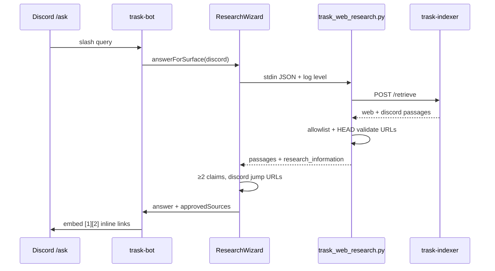

# fix: Trask Discord — ≥2 valid citations, Discord RAG links, exhaustive research logs

## Summary

Discord `/ask` currently collapses grounded compose to **one** brief line and **one** inline `[1]`, while the verify gate can pass with a single link when `approvedSources.length < 2`. Discord passages are retrieved as `discord://…` but are **stripped** from embed citations, so channel history never appears as clickable message links even when the indexer has relevant chunks. DuckDuckGo fallback snippets can cite URLs that were never fetched or validated, producing broken `[1]` targets. This plan enforces **≥2 distinct, reachable citations** on the Discord surface (web and/or Discord jump links), surfaces **https://discord.com/channels/…** links when Discord evidence is used, adds **URL validation** before cite, turns on **operator-visible research logging** (Python `logging` + Node bridge), and hardens verification so regressions cannot ship silently.

---

## Problem Frame

Members expect `/ask` to behave like a careful researcher: multiple independent sources, links that open real pages, and community knowledge from the bot’s own channels when it matters. Today the opposite happens often: one citation, a dead link, and no sign that Discord history was searched — even though `TRASK_DISCORD_SYNC_INTERVAL_MS` and Chroma Discord indexing exist in-repo.

**Root causes ([REPO]):**

| Symptom | Cause |
|--------|--------|
| Only `[1]` in embed | `composeGroundedAnswerFromClaims` uses `briefClaims = indexed.slice(0, 1)` in `packages/trask/src/grounded-evidence.ts` |
| Verify allows 1 link | `scripts/verify_trask_discord_live.mjs` sets `minLinked = approvedSources.length >= 2 ? 2 : 1` |
| Discord not cited | `filterPublicWebCitationSources` drops non-`http(s)` URLs; brief compose only materializes web `homeUrl` |
| `discord://` not clickable | Indexer stores `discord://channels/{channelId}/{msgId}` without guild id; no conversion to public jump URLs |
| Invalid `[1]` page | DDG path in `scripts/trask_web_research.py` never HTTP-fetches; claims can cite unvisited or 404 URLs |
| No scrape visibility | `trask_web_research.py` has no `logging` module; subprocess stderr is not structured |

---

## Requirements

- **R1.** Discord `/ask` answers must include **≥2 distinct inline citations** (`[1](url)` and `[2](url)`) on every successful (non-degraded) reply, unless the operator explicitly enables a documented single-source degraded mode (default off).
- **R2.** Each cited URL must be **reachable** (HTTP HEAD or GET with timeout) on an allowlisted host **or** a valid `https://discord.com/channels/{guild}/{channel}/{message}` jump link before it is shown to users.
- **R3.** When vector retrieve returns relevant **Discord** passages, at least one citation must be a **Discord message jump link** (not only generic web catalog pages).
- **R4.** Discord channel history must be **indexed and queryable** on the live bot path: sync job runs on a schedule (or at bot startup) and retrieve returns `authority=discord` passages for fixture queries.
- **R5.** Research pipeline emits **exhaustive structured logs** from query start through final JSON stdout: retrieval source, passage counts, filter decisions, DDG fallback, per-URL fetch status, and final citation list — **INFO** by default, **DEBUG** when `TRASK_RESEARCH_LOG_LEVEL=DEBUG` or `-v` / `--verbose` on `scripts/trask_web_research.py`.
- **R6.** Node bridge (`packages/trask/src/trask-research-subprocess.ts`) forwards Python logs to the Trask bot logger without losing lines; optional `TRASK_RESEARCH_LOG_VERBOSE=1` mirrors DEBUG to stderr.
- **R7.** Gates: unit tests for compose/citation policy; `pnpm verify:trask-discord` requires ≥2 links **always** and optional HEAD checks; evidence doc with sample log excerpt.

**Origin actors:** A2 (Discord `/ask` user), A3 (operator)

**Origin flows:** F2 (retrieve-first Q&A), F3 (Discord at query time)

**Origin acceptance examples:** AE-3 (Discord retrieve), AE-4 (crawl corpus); Holocron R-14 unchanged (≥2 `https://` on public web UI)

---

## Scope Boundaries

- Holocron full-profile compose layout (unchanged contract).
- Replacing Crawl4AI ingest or rebuilding the indexer embedding model.
- CI secrets for live Discord browser automation (local/script gates only).
- Logging every LLM token (prompt/response bodies stay at DEBUG and truncated).

### Deferred to Follow-Up Work

- Playwright against Discord.com in CI.
- HEAD caching / CDN-aware reachability service shared across workers.
- Public Holocron showing `discord://` in Sources panel (still web-only per R-15).

---

## Context & Research

### Relevant Code and Patterns

- `packages/trask/src/grounded-evidence.ts` — `composeGroundedAnswerFromClaims`, `hasMinimumBriefGroundedSupport`, `filterPublicWebCitationSources` consumers
- `packages/trask/src/research-wizard.ts` — `tryGroundedCompose`, `answerQuestionBrief`, `collectWebEvidenceSources`, unused `minWebCitationsForProfile`
- `packages/trask/src/discord-reply-format.ts` — `embedInlineCitationLinks`, `buildCitationUrlMap`
- `data/trask/profiles/surfaces.json` — `discord.minWebCitations: 2` (not enforced today)
- `data/trask/policy.json` — `minWebCitations: 2`
- `scripts/trask_web_research.py` — retrieve order, DDG fallback, allowlist filter
- `infra/trask-indexer/trask_indexer/discord_index.py` — `discord://` URL shape
- `scripts/trask_discord_sync.py`, `apps/trask-bot/src/discord-index-sync.ts` — export → index
- `scripts/verify_trask_discord_live.mjs` — current weak `minLinked` rule

### Institutional Learnings

- `docs/solutions/tooling-decisions/trask-crawl4ai-research-cutover-2026-05-19.md` — retrieve order and env vars
- Plan 003 — compact Discord display; **do not** reintroduce multi-topic catalog dumps when adding a second citation line

### External References

- [Discord message links](https://support.discord.com/hc/en-us/articles/228383668-Usable-Links) — `https://discord.com/channels/guild_id/channel_id/message_id`

---

## Key Technical Decisions

- **Two brief lines, two citations:** Discord brief compose emits **up to 2** anchored claims (still ≤5 display lines after format), each with its own `[n]`, instead of one `slice(0, 1)` line. Keeps UX compact while meeting the ≥2 source bar.
- **Surface-specific citation allowlist:** Holocron keeps web-only public citations. Discord surface adds `https://discord.com/channels/` URLs via a new helper (e.g. `filterCitationSourcesForSurface`) — do not globally allow `discord://` in Holocron.
- **Guild-aware jump URLs:** Extend Discord index metadata (`guild_id`, `channel_id`, `message_id` / window) and retrieve JSON so Node can build jump links without guessing.
- **Validate before cite:** After retrieve, run bounded HTTP HEAD/GET for each candidate `https://` citation URL (reuse fetch timeout from `data/trask/retrieval.defaults.json`). Drop failures; if fewer than two remain, abstain or source-only — do not emit broken links.
- **DDG is bootstrap-only for compose:** When `index_miss` and DDG is enabled, either fetch allowlisted pages into passages (preferred) or mark DDG URLs as `unverified` and exclude from citation until fetched. Aligns with origin R-2 (no compose from unverified snippets).
- **Logging contract:** Python uses `logging.getLogger("trask.research")` with `basicConfig` level from `TRASK_RESEARCH_LOG_LEVEL` (default INFO) and CLI `-v` → DEBUG. Log at phase boundaries (stdin parsed, HTTP retrieve, chroma, DDG, allowlist filter, per-passage, stdout summary). Node logs subprocess stderr line-by-line at `info`/`debug` matching level.

---

## Open Questions

### Resolved During Planning

- **Why only one source?** Brief profile intentionally limited to one composed claim; verify gate waived second link when pool < 2.
- **Why no Discord links?** Public-web citation filter + missing guild id in indexer URLs.

### Deferred to Implementation

- Exact HEAD status codes to accept (301/302 follow policy).
- Whether to run URL validation in Python only, Node only, or both (recommend Python at retrieve time + Node sanity check before embed).

---

## High-Level Technical Design

> *Directional guidance for review, not implementation specification.*

---

## Implementation Units

- U1. **Enforce ≥2 citations on Discord brief compose**

**Goal:** Every successful Discord answer cites at least two distinct sources in body and `approvedSources`.

**Requirements:** R1

**Dependencies:** None

**Files:**
- Modify: `packages/trask/src/grounded-evidence.ts`
- Modify: `packages/trask/src/research-wizard.ts`
- Modify: `data/trask/prompts/discord-brief-compose.md`
- Modify: `packages/trask/src/grounded-evidence.test.ts`
- Test: `packages/trask/src/discord-reply-format.test.ts`

**Approach:**
- Change brief compose to select **2** query-anchored claims from distinct URLs (not `slice(0, 1)`).
- Replace `hasMinimumBriefGroundedSupport` with surface-aware minimum: **2** web URLs, or **1 web + 1 discord**, or **2 discord** when both exist — aligned with `hasMinimumGroundedSupport` but requiring count ≥2 for Discord surface.
- Wire `minWebCitationsForProfile("discord")` into `tryGroundedCompose` / `answerQuestionBrief`; if aligned sources < minimum after compose, fall back to `sourceOnlyFallbackAnswer` with up to 5 ranked URLs (not a single link).
- Update `discord-brief-compose.md` to require two citations minimum.

**Test scenarios:**
- Happy path: brief compose with 3 claims in → body contains `[1]` and `[2]` with different URLs in Sources block.
- Edge case: only one distinct URL in passages → compose returns null / degraded path (no single-link success).
- Error path: second claim duplicates first URL → deduped; if only one URL remains, fail minimum bar.

**Verification:**
- `pnpm exec node --test packages/trask/dist/grounded-evidence.test.js` passes new cases.

---

- U2. **Discord RAG: index metadata, retrieve, and jump-link citations**

**Goal:** Relevant Discord history appears in retrieve results and as clickable `https://discord.com/channels/…` citations on `/ask`.

**Requirements:** R3, R4

**Dependencies:** None (can parallel U1)

**Files:**
- Modify: `infra/trask-indexer/trask_indexer/discord_index.py`
- Modify: `infra/trask-indexer/trask_indexer/chroma_store.py` (if metadata passthrough needed)
- Modify: `scripts/trask_web_research.py` (pass `authority` / metadata through)
- Create: `packages/trask/src/discord-citation-url.ts` (or extend `grounded-evidence.ts`)
- Modify: `packages/trask/src/research-wizard.ts`
- Modify: `packages/trask/src/discord-reply-format.ts`
- Test: `packages/trask/src/discord-citation-url.test.ts` (new)

**Approach:**
- At index time, persist `guild_id` (from export manifest), `channel_id`, `first_message_id`, `last_message_id` in passage metadata; keep `discord://` as internal key if needed.
- Add `discordJumpUrl(metadata) -> https://discord.com/channels/...` using **first** message id in window for stable links.
- New `filterCitationSourcesForSurface(sources, surface)` allowing discord.com jump URLs for `discord` surface only.
- When ranking claims for brief compose, **boost** discord authority when web recall is thin; require discord jump link in output when discord passages were retrieved and anchored (R3).
- Ensure `trask_discord_sync.py` writes manifest guild id into export consumed by indexer.

**Test scenarios:**
- Happy path: passage with metadata → jump URL matches `https://discord.com/channels/{guild}/{channel}/{message}`.
- Edge case: missing guild id in legacy chunk → skip discord citation, log warning.
- Integration: fixture export indexed; retrieve query matches fixture content; compose includes discord.com link.

**Verification:**
- Fixture-based unit tests pass; manual check with `TRASK_DISCORD_SYNC_INTERVAL_MS > 0` and query known to exist in `#discord-bot-testing`.

---

- U3. **URL reachability and scrape truthfulness**

**Goal:** No cited `[n]` points at a page that was not retrieved or returns HTTP error.

**Requirements:** R2

**Dependencies:** U1 (citation list), U2 (discord URLs exempt from HEAD or use GET on jump URL)

**Files:**
- Modify: `scripts/trask_web_research.py`
- Modify: `data/trask/retrieval.defaults.json` (document `urlVerifyTimeoutMs` if added)
- Modify: `packages/trask/src/research-wizard.ts`
- Test: `scripts/trask_web_research.test.py` or extend existing indexer tests

**Approach:**
- After passage assembly, for each candidate `https://` URL (not discord.com), run HEAD/GET with timeout; log status code and final URL; drop failures.
- For DDG fallback: optionally fetch top N allowlisted hits into quote text (reuse httpx pattern from indexer crawl) before emitting passages — so “scrape” actually happened.
- Node: reject `approvedSources` whose `homeUrl` failed verification flag in payload (`research_information.rejected_source_urls` already exists — populate consistently).
- Shallow catalog roots: keep existing `isShallowCatalogRootUrl` demotion when a deep URL from the same host exists.

**Test scenarios:**
- Happy path: valid passage URL → `verified: true` in payload.
- Edge case: 404 URL → excluded from passages / rejected list.
- Error path: timeout → logged at WARNING, URL dropped.

**Verification:**
- Scripted run logs show `url_verify` lines for each candidate; embed links return 200 on manual click sample.

---

- U4. **Exhaustive research logging (Python + Node)**

**Goal:** Operators can trace a single `/ask` from stdin to stdout with DEBUG when needed.

**Requirements:** R5, R6

**Dependencies:** None

**Files:**
- Modify: `scripts/trask_web_research.py`
- Modify: `scripts/trask_discord_sync.py` (same logger pattern)
- Modify: `packages/trask/src/trask-research-subprocess.ts`
- Modify: `apps/trask-bot/src/main.ts` (log research start/end for `/ask`)
- Modify: `docs/trask-ops.md`

**Approach:**
- `from logging import getLogger` + `configure_logging(verbose: bool)` reading `TRASK_RESEARCH_LOG_LEVEL` and `-v`/`--verbose` argv (document that CLI flags apply when script invoked directly; Node sets env for subprocess).
- Log phases at INFO: `research_start`, `retrieve_http`, `retrieve_chroma`, `ddg_fallback`, `allowlist_filter`, `url_verify`, `passage_summary`, `research_done` with counts and timings.
- Log at DEBUG: full query payload (redact tokens), per-passage quote length/url, filter reasons.
- Node: stream stderr to logger; prefix `[trask-research]`; honor `TRASK_RESEARCH_LOG_VERBOSE`.
- **Note:** “10000 lines” is an operational goal when DEBUG is on for a heavy query — implement high-volume **structured** DEBUG lines, not a literal counter.

**Test scenarios:**
- Happy path: INFO run produces phase lines without DEBUG env.
- Edge case: `-v` sets DEBUG and increases line volume.
- Integration: one `/ask` in bot logs shows retrieve → N passages → M verified URLs.

**Verification:**
- `TRASK_RESEARCH_LOG_LEVEL=DEBUG node scripts/verify_trask_discord_live.mjs` produces multi-KB stderr; ops doc lists env vars.

---

- U5. **Discord index freshness on the live bot**

**Goal:** Running trask-bot keeps Chroma Discord chunks current without manual export CLI.

**Requirements:** R4

**Dependencies:** U2

**Files:**
- Modify: `packages/config/src/index.ts` (document default interval if changing)
- Modify: `apps/trask-bot/src/discord-index-sync.ts`
- Modify: `docs/trask-ops.md`, `AGENTS.md`

**Approach:**
- Document recommended `TRASK_DISCORD_SYNC_INTERVAL_MS` (e.g. 15–60 min) for production; run **one** sync on bot startup when interval > 0.
- Log sync success/failure with chunk counts from script stdout.
- Operator checklist: indexer up, sync enabled, blacklist configured.

**Test scenarios:**
- Happy path: interval > 0 schedules repeat sync.
- Edge case: sync script missing → warn once, bot still starts.

**Verification:**
- Bot logs show sync completion; retrieve returns discord passages for known channel content.

---

- U6. **Verification gates and docs**

**Goal:** Regressions caught by CI-local scripts and documented operator workflow.

**Requirements:** R7

**Dependencies:** U1–U5

**Files:**
- Modify: `scripts/verify_trask_discord_live.mjs`
- Modify: `scripts/verify_trask_cli_qa.mjs` (if shared minimum citations)
- Modify: `AGENTS.md`
- Create: `docs/evidence/2026-05-19-discord-multi-source-logging.md`

**Approach:**
- `verify_trask_discord_live.mjs`: always `minLinked = 2`; fail if any `](https://…)` URL returns non-2xx (HEAD, concurrency limit); optional flag `--skip-url-check` for offline dev only.
- Add golden query tagged `requiresDiscordCitation` when fixture index present.
- AGENTS.md: Discord gate requires ≥2 links **and** reachable URLs; mention `TRASK_RESEARCH_LOG_LEVEL=DEBUG`.

**Test scenarios:**
- Happy path: 10/10 queries with ≥2 links and HEAD ok.
- Edge case: `--skip-url-check` for air-gapped dev.

**Verification:**
- `pnpm verify:trask-discord` exits 0 with indexer + env documented in evidence file.

---

## System-Wide Impact

- **Interaction graph:** `/ask` → `answerForSurface("discord")` → Python subprocess → indexer `/retrieve` → grounded compose → `formatDiscordAskDisplay` → embed.
- **Error propagation:** URL verify failures reduce passage pool; if <2 verified sources, user sees degraded message (existing SLA), not broken links.
- **API surface parity:** Holocron `answerQuestion` keeps ≥2 https citations; Discord adds discord.com jump links — do not change Holocron Sources panel policy.
- **Unchanged invariants:** Public Holocron still requires ≥2 approved `https://` hosts; `TRASK_GROUNDED_COMPOSE` default on; Discord 5-line embed cap from plan 003.

---

## Risks & Dependencies

| Risk | Mitigation |
|------|------------|
| Two-line brief answers feel long | Cap at 2 claims × 1 line each; keep `DISCORD_ASK_MAX_BODY_LINES` |
| HEAD checks slow `/ask` | Parallel HEAD with short timeout; cache per URL in-process for request lifetime |
| Discord jump links need guild id in old chunks | Re-sync Discord index after deploy; log missing-metadata warnings |
| DEBUG log volume | INFO default; rotate/truncate in ops guidance |
| Indexer down | Clear degraded message + logs showing `index_miss` (existing) |

---

## Documentation / Operational Notes

- `docs/trask-ops.md`: logging env vars, sync interval, how to trace one query end-to-end.
- `AGENTS.md`: update mandatory Discord verification bullets (≥2 links, URL check, DEBUG logging command).
- Evidence template under `docs/evidence/` with sample log snippet and screenshot of two working links.

---

## Sources & References

- **Origin document:** [docs/brainstorms/trask-rag-discord-compose-requirements.md](docs/brainstorms/trask-rag-discord-compose-requirements.md)
- **Prior plan:** [docs/plans/2026-05-19-003-fix-trask-discord-ask-ux-sources-plan.md](docs/plans/2026-05-19-003-fix-trask-discord-ask-ux-sources-plan.md)
- **Code:** `packages/trask/src/grounded-evidence.ts`, `scripts/trask_web_research.py`, `infra/trask-indexer/trask_indexer/discord_index.py`
- **Learning:** [docs/solutions/tooling-decisions/trask-crawl4ai-research-cutover-2026-05-19.md](docs/solutions/tooling-decisions/trask-crawl4ai-research-cutover-2026-05-19.md)
