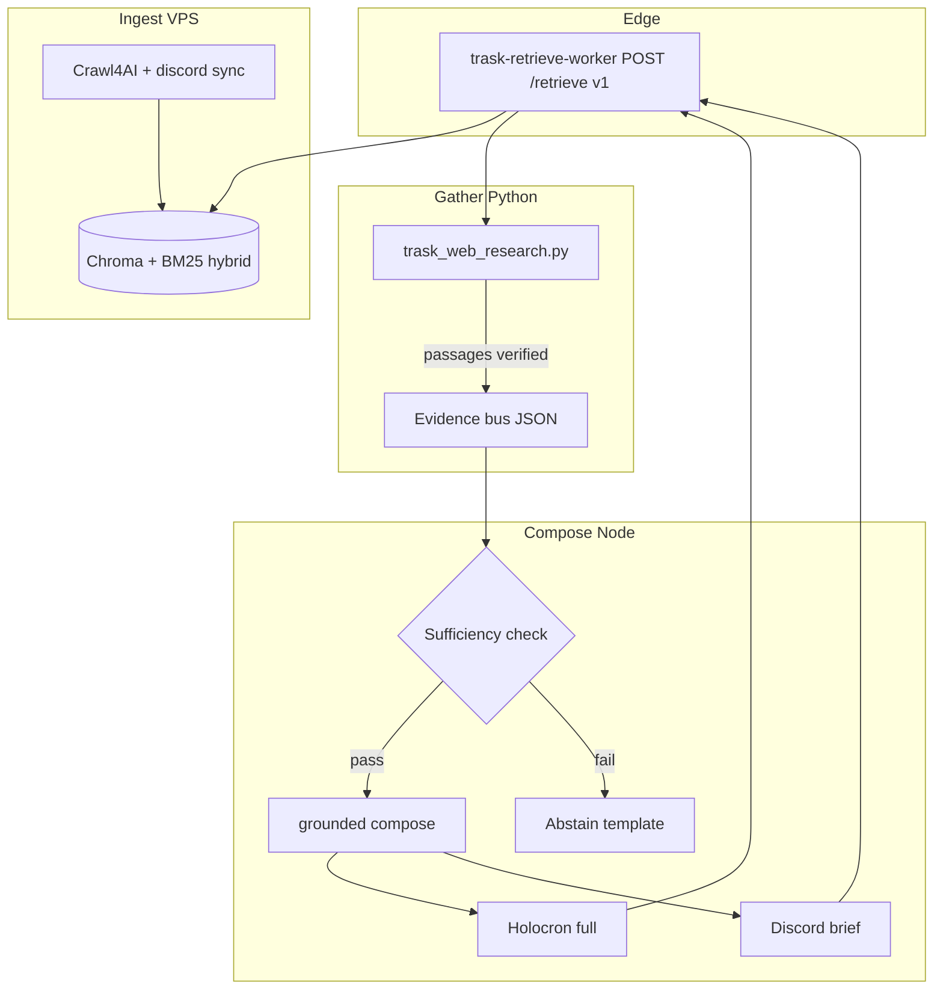

# Trask research agent — 2026 industry standards bar

## Summary

This plan raises Trask/Holocron/Discord from “RAG that sometimes passes gates” to a **2026 production research-agent bar**: owned crawl → hybrid retrieve at a **versioned Cloudflare Worker** → **structured verified passages** → **sufficiency-gated grounded compose** with **mandatory multi-source citations** when evidence supports them, and a **three-layer eval ladder** (offline faithfulness, Worker contract smoke, live browser). It consolidates overlapping May-19 plans into one execution spine and defers Vectorize migration until Chroma-path quality matches golden and expert queries under Worker-only CI.

---

## Problem Frame

Users see **partial grounding** (e.g. “1 cited source, status partial” on save-location questions), **topic drift**, and **fragile verification** despite a correct high-level architecture (Crawl4AI → Chroma → Worker → grounded compose). Root causes are not “missing RAG” but **retrieve quality** (dense-only, weak recall on tool-name queries), **lossy markdown report hot path**, **dual URL verification**, **anchor filtering that drops valid second sources**, **CI that bypasses the Worker** (`TRASK_INDEXER_BASE_URL=http://127.0.0.1:8790` in `ci.yml`), and **docs/agents still describing DuckDuckGo-first research. The product mandate remains: **only cite real `https://` URLs from retrieved passages** — never catalog invention.

---

## Requirements

- R1. **Owned corpus path only** for “grounded” answers: Crawl4AI ingest → embed/index → `POST /retrieve` via Worker (not raw Chroma from clients).
- R2. **Citation contract**: every `https://` in an answer must map to a retrieved passage for that query; ≥2 distinct sources when the index supports it; abstain or honest degrade when insufficient — not fluent partial essays.
- R3. **Retrieve quality**: hybrid lexical + dense (RRF), candidate pool 12–20, rerank to 3–6 passages before compose ([Chroma hybrid](https://docs.trychroma.com/cloud/search-api/hybrid-search), [Google sufficient context](https://research.google/blog/deeper-insights-into-retrieval-augmented-generation-the-role-of-sufficient-context/)).
- R4. **Latency budgets**: Discord `/ask` ≤90s wall; Holocron interactive ≤~120–180s gather+compose; no default 900s masking hangs (`packages/config` research timeout vs `apps/trask-bot` clamp).
- R5. **Eval ladder in CI**: offline faithfulness + config drift + holocron e2e + Worker retrieve smoke on **:8787**; browser expert queries remain mandatory for agents when MCP available (`AGENTS.md`).
- R6. **Wrangler CI/CD** remains authoritative for retrieve deploy (`.github/workflows/trask-retrieve-worker.yml`).

**Origin actors:** Holocron users, Discord `/ask` users, operators indexing corpus, CI/agents validating releases.

**Origin flows:** Ask question → retrieve passages → grounded answer with citations → surface-specific display (web Sources panel vs Discord inline links).

**Origin acceptance examples:** AE1 — expert save query returns **grounded** with ≥2 live citations; AE2 — TSLPatcher query cites TSLPatcher/2DA sources only; AE3 — unanswerable query abstains without invented URLs.

---

## Scope Boundaries

- Replacing Crawl4AI with a different crawler (unless blocked by crawl failures).
- Full **Vectorize + D1** cutover in this plan (Phase 2 track only; keep Worker contract stable).
- Holocron UI redesign beyond provenance/citation display fixes.
- Public multi-tenant retrieve API without auth (auth design included; implementation can follow).
- Re-litigating Pazaak/Nakama gameplay backends.

### Deferred to Follow-Up Work

- **Vectorize migration** behind same `/retrieve` v2 once golden recall is stable on Chroma ([Cloudflare RAG reference](https://developers.cloudflare.com/vectorize/examples/rag/)).
- **Managed Cloudflare AI Search** as an alternative to self-hosted indexer ops.
- **Multi-hop agentic research** for Holocron “deep research” mode (Discord stays retrieve-then-compose).
- **PR template + GitHub issue templates** with Trask-specific checklists (small doc PR).

---

## Context & Research

### Relevant Code and Patterns

| Layer | Path | Role |
|-------|------|------|
| Indexer | `infra/trask-indexer/trask_indexer/chroma_store.py` | Dense retrieve today; target hybrid+rerank |
| Retrieve API | `infra/trask-indexer/trask_indexer/retrieve_api.py` | `POST /retrieve` contract |
| Edge gateway | `infra/trask-retrieve-worker/src/index.ts` | Proxy to indexer; clients must use only this |
| Gather | `scripts/trask_web_research.py` | Retrieve, allowlist, URL verify, optional DDG |
| Compose | `packages/trask/src/grounded-evidence.ts`, `research-wizard.ts` | Claims, compose, grounding status |
| Surfaces | `apps/holocron-web`, `apps/trask-bot`, `apps/trask-http-server` | Delivery + SLAs |
| Policy | `data/trask/eval/verification-queries.json`, `data/trask/profiles/surfaces.json` | Expert gates vs golden seed |
| CI | `.github/workflows/ci.yml`, `trask-retrieve-worker.yml` | **Gap:** e2e hits :8790 not Worker |

### Institutional Learnings

- `docs/solutions/tooling-decisions/trask-crawl4ai-research-cutover-2026-05-19.md` — subprocess bridge, passages contract, DDG optional.
- `docs/brainstorms/2026-05-19-trask-rag-fidelity-requirements.md` — R1–R4 citation fidelity, Worker proxy.
- Completed plans `2026-05-19-003`, `004` — Discord display/logging; **do not duplicate**; build on them.

### External References (2025–2026)

| Topic | Source |
|-------|--------|
| Sufficient context / abstain | [Google Research, May 2025](https://research.google/blog/deeper-insights-into-retrieval-augmented-generation-the-role-of-sufficient-context/) |
| URL hallucination vs link rot | [urlhealth, arXiv:2604.03173](https://arxiv.org/pdf/2604.03173) |
| Hybrid + rerank funnel | [Ranking stack, Feb 2026](https://slavadubrov.github.io/blog/2026/02/08/building-a-modern-search-ranking-stack-from-embeddings-to-llm-powered-relevance/) |
| Faithfulness eval | [RAGAS Faithfulness](https://docs.ragas.io/en/latest/concepts/metrics/available_metrics/faithfulness/) |
| Citation benchmarks | [ALCE](https://arxiv.org/pdf/2305.14627), [FreeCite](https://github.com/flozxwer/FreeCite) |
| CF RAG architecture | [Vectorize RAG](https://developers.cloudflare.com/vectorize/examples/rag/) |
| Crawl4AI ingest | [Crawl4AI docs](https://docs.crawl4ai.com/) |

---

## Key Technical Decisions

- **Keep Worker as the only client retrieve URL** — `TRASK_INDEXER_BASE_URL` defaults to `http://127.0.0.1:8787` in `packages/config/src/index.ts`; CI must match production (see origin: `docs/knowledgebase/10-architecture-runtime/answer-pipeline.md`).
- **Passages JSON is the evidence bus** — demote narrative `report` to debug-only; compose reads structured `passages[]` with stable ids and `verified: true` metadata (see origin: architecture review).
- **Python owns retrieve science; Node owns faithfulness compose + surfaces** — no second compose runtime; optional CPU rerank stays on indexer VPS.
- **Sufficiency gate before compose** — if top passages do not cover query anchors, return abstention template instead of `status: partial` with one citation ([Google sufficient context](https://research.google/blog/deeper-insights-into-retrieval-augmented-generation-the-role-of-sufficient-context/)).
- **Single URL verification authority** — verify in Python at gather time; Node trusts metadata unless Discord jump-link exceptions (`packages/trask/src/discord-citation-url.ts`).
- **Remove live lexical merge** — `searchLocalKnowledge` / `FileChunkStore` must not feed answers unless also indexed in Chroma (dead path today per repo research).
- **DDG off in production paths** — `TRASK_WEB_RESEARCH_DDG_FALLBACK=0`; update `AGENTS.md` which still implies DDG-first bootstrap.
- **Hybrid retrieval before Vectorize** — quality on current stack first; Vectorize is Phase 2 with re-embed, not a citation-fidelity shortcut.

---

## Open Questions

### Resolved During Planning

- **Is the architecture direction wrong?** No — proxy Worker + Chroma indexer matches 2026 edge-gateway pattern; execution quality and eval parity are the gaps.
- **Should compose move to Python?** No — Discord/Holocron formatters and grounding status are Node-native; keep retrieve/rank in Python.

### Deferred to Implementation

- Exact cross-encoder model for CPU rerank on indexer host.
- Whether to add Wayback probe for “hallucinated URL” vs “link rot” (urlhealth pattern) in v1 or v1.1.
- Production auth model for public Worker (API key vs Cloudflare Access vs Holocron-only).

---

## High-Level Technical Design

> This illustrates the intended approach and is directional guidance for review, not implementation specification. The implementing agent should treat it as context, not code to reproduce.

**Target retrieve funnel (indexer):** query → embed → hybrid recall (k≈15) → cross-encoder rerank (k≈4) → return passages with `{ url, quote, indexed_at, authority, verified }`.

---

## Implementation Units

- U1. **Hybrid retrieval + rerank in indexer**

**Goal:** Fix recall failures on tool-name and save-path queries that drive partial grounding.

**Requirements:** R3, R1

**Dependencies:** None

**Files:**
- Modify: `infra/trask-indexer/trask_indexer/chroma_store.py`
- Modify: `infra/trask-indexer/trask_indexer/retrieve_api.py` (optional `mode` flag)
- Test: `infra/trask-indexer/tests/` (add if missing), `scripts/smoke_trask_indexed_stack.py`

**Approach:**
- Add BM25/sparse leg + RRF merge with dense embeddings ([Chroma hybrid search](https://docs.trychroma.com/cloud/search-api/hybrid-search)).
- Retrieve 12–20 candidates; CPU cross-encoder rerank to top 4–6.
- Preserve `host` filter for Discord passages.

**Patterns to follow:**
- Existing `query_passages` in `chroma_store.py`
- Brainstorm R2 anchor boosting for TSLPatcher/MDLOps/saves topics

**Test scenarios:**
- Happy path: golden saves query returns deadlystream + steamcommunity passages in top 4.
- Happy path: TSLPatcher query returns tslpatcher + deadlystream in top 4, not reone/mdlops.
- Edge case: empty Chroma returns explicit `index_miss` without DDG when fallback disabled.

**Verification:**
- `bash scripts/trask_index_seed_for_qa.sh` then smoke retrieve for five golden + five expert paraphrases returns ≥2 relevant URLs per query.

---

- U2. **Evidence bus: passages-only hot path**

**Goal:** Stop losing citations in markdown report re-parse; align subprocess → wizard on `passages[]`.

**Requirements:** R2, R1

**Dependencies:** U1 (better passages), can start in parallel

**Files:**
- Modify: `scripts/trask_web_research.py`
- Modify: `packages/trask/src/trask-research-subprocess.ts`
- Modify: `packages/trask/src/research-wizard.ts`
- Modify: `packages/trask/src/grounded-evidence.ts` (`claimsFromDistinctPassages` backfill rules)
- Test: `packages/trask/dist/grounded-evidence.test.js`, `packages/trask/dist/research-wizard.test.js`

**Approach:**
- Subprocess stdout prioritizes `passages`; `report` optional/debug.
- Wizard `fetchResearchReport` uses `passagesFromRetrieveRows` directly when present.
- Extend passage DTO with `indexed_at`, `content_hash`, `verified`.

**Test scenarios:**
- Integration: subprocess JSON for saves query includes ≥2 passages with distinct URLs.
- Happy path: wizard does not call LLM compose when template already has ≥2 citation indices.
- Edge case: empty passages → failed grounding, not partial with invented text.

**Verification:**
- Unit tests pass; one manual `runTraskWebResearch` trace logged with passage count.

---

- U3. **Sufficiency gate + abstain over partial**

**Goal:** Replace “partial” Holocron/Discord answers with honest abstention when evidence cannot support ≥2 cites.

**Requirements:** R2, R4

**Dependencies:** U2

**Files:**
- Modify: `packages/trask/src/grounded-evidence.ts` (`inferGroundingStatus`, sufficiency helper)
- Modify: `packages/trask/src/research-wizard.ts`
- Modify: `data/trask/prompts/grounded-brief.md`, `grounded-full.md`
- Modify: `apps/holocron-web` (display abstain copy if needed)
- Test: `packages/trask/dist/grounded-evidence.test.js`

**Approach:**
- Implement `hasSufficientContext(query, passages)` — anchor token coverage + min distinct hosts + min rerank score gap.
- If insufficient: short abstention + optional single verified link; **never** `status: partial` with one cite when policy requires two.
- Discord brief: same gate via `hasMinimumDiscordBriefGroundedSupport`.

**Test scenarios:**
- Covers AE3: off-topic query with irrelevant passages → abstain, no fabricated TSLPatcher answer.
- Happy path: saves query with 2+ passages → `grounded`.
- Edge case: one passage only but high confidence → policy decision documented in `surfaces.json` (allow 1 for cli only if needed).

**Verification:**
- Browser: expert saves query shows **grounded, 2 cited** on fresh thread.
- `pnpm holocron:e2e` passes expert query 4 without partial provenance.

---

- U4. **Single URL verification + citation contract enforcement**

**Goal:** One verify authority; strip unreachable URLs before compose; optional Wayback for stale vs hallucinated.

**Requirements:** R2

**Dependencies:** U2

**Files:**
- Modify: `scripts/trask_web_research.py` (`_verify_passages`, metadata)
- Modify: `packages/trask/src/citation-url-verify.ts` (trust only `verified: true`)
- Modify: `packages/trask/src/grounded-evidence.ts` (alignCitedSourcesToAnswer)
- Test: `scripts/lib/url-verify.mjs`, faithfulness fixtures

**Approach:**
- Python sets `verified: true` on surviving passages; log rejections to stderr (existing pattern).
- Node skips re-HEAD when `verified: true` unless `TRASK_FORCE_URL_VERIFY=1`.
- Document `TRASK_TRUST_INDEXER_CITATION_URLS` as dev-only escape hatch.

**Test scenarios:**
- Happy path: known-good golden URLs pass; compose cites only those URLs.
- Error path: 404 URL in fixture corpus is dropped before compose.
- Integration: `pnpm trask:faithfulness-eval` passes after alignment changes.

**Verification:**
- `node scripts/lib/url-verify.mjs` on golden fixture URLs.
- No answer contains URL not present in passage list for that query.

---

- U5. **CI / Worker parity + eval ladder**

**Goal:** CI exercises the same path as production and blocks citation regressions.

**Requirements:** R5, R6

**Dependencies:** U1–U4 (incremental OK; start Worker in CI early)

**Files:**
- Modify: `.github/workflows/ci.yml`
- Modify: `.github/workflows/trask-retrieve-worker.yml` (post-deploy smoke)
- Modify: `scripts/trask_live_stack.sh`, `scripts/holocron-e2e-live-server.sh`
- Modify: `package.json` scripts if needed
- Test: `apps/holocron-web/e2e/holocron-research.spec.ts`

**Approach:**
- Start Worker on :8787 in CI; set `TRASK_INDEXER_BASE_URL=http://127.0.0.1:8787` for holocron e2e and smoke scripts.
- Add jobs: `pnpm trask:faithfulness-eval`, `pnpm trask:config-drift` after build.
- Optional: `pnpm verify:trask-discord` job when secrets available (document as manual gate otherwise).
- Post-deploy: `curl` Worker `/health` + sample retrieve when CF secrets present.

**Test scenarios:**
- CI log shows retrieve via :8787 not :8790 for e2e job.
- Faithfulness eval fails if compose drops second citation mapping.

**Verification:**
- Green CI on PR; local `HOLOCRON_REUSE_SERVER=1 TRASK_INDEXER_BASE_URL=http://127.0.0.1:8787 pnpm holocron:e2e`.

---

- U6. **Tiered timeouts + gather sidecar (latency)**

**Goal:** Align config with Discord 90s and Holocron UX; reduce subprocess spawn overhead.

**Requirements:** R4

**Dependencies:** U2

**Files:**
- Modify: `packages/config/src/index.ts`, `data/trask/retrieval.defaults.json`
- Modify: `packages/trask/src/trask-research-subprocess.ts`
- Modify: `apps/trask-bot/src/main.ts` (document budget)
- Modify: `docs/knowledgebase/50-execution/trask-configuration-env-map.md`

**Approach:**
- Replace single 900s default with `TRASK_RESEARCH_GATHER_MS`, `TRASK_RESEARCH_COMPOSE_MS`, surface caps.
- Long-running batch eval retains high ceiling via explicit env.
- Phase 1b: HTTP sidecar for `trask_web_research` in indexer container (defer if scope tight).

**Test scenarios:**
- Discord path kills gather at 90s with user-visible message, not silent hang.
- Holocron e2e completes within 200s UI wait.

**Verification:**
- Timed run of expert query on Discord verify script < 90s when indexer warm.

---

- U7. **Docs + authority consolidation**

**Goal:** One operator/agent path; remove DDG-first and discord-excluded drift.

**Requirements:** R5

**Dependencies:** None (can parallel)

**Files:**
- Modify: `AGENTS.md`
- Modify: `docs/knowledgebase/10-architecture-runtime/trask-runtime-map.md`, `answer-pipeline.md`
- Modify: `docs/solutions/tooling-decisions/trask-crawl4ai-research-cutover-2026-05-19.md`
- Modify: `docs/plans/2026-05-19-001-feat-trask-crawl4ai-rag-plan.md` (status superseded pointer)
- Create: `docs/knowledgebase/10-architecture-runtime/trask-research-agent-2026-standards.md` (short authority)

**Approach:**
- State: Crawl4AI → Chroma → **Worker only** → grounded compose; DDG off by default.
- E2e/browser gates use **verification-queries.json**, not golden literals.
- Mark plans 003/004 complete; 001/002 point to this plan for remaining work.

**Test scenarios:**
- Test expectation: none — documentation slice; validated by `pnpm trask:config-drift` and agent checklist review.

**Verification:**
- New agent reading only `AGENTS.md` + KB authority doc reaches correct stack in <5 minutes.

---

- U8. **Remove dead lexical merge from live Q&A**

**Goal:** Eliminate dual-store confusion (`FileChunkStore` vs Chroma).

**Requirements:** R1

**Dependencies:** U2

**Files:**
- Modify: `packages/trask/src/research-wizard.ts`
- Modify: `docs/knowledgebase/10-architecture-runtime/trask-synthesis-and-chunk-retrieval.md`

**Approach:**
- Gate `searchLocalKnowledge` behind explicit dev flag or remove from `answerQuestion` hot path.
- Ingest-worker may still populate chunks for catalog operations.

**Test scenarios:**
- Happy path: answer citations only reference URLs present in Chroma retrieve response.
- Integration: no answer cites only `INGEST_STATE_DIR` file paths unless reindexed into Chroma.

**Verification:**
- Grep confirms no live call path to `searchLocalKnowledge` in grounded mode.

---

## System-Wide Impact

- **Interaction graph:** Indexer crawl → Chroma → Worker → Python gather → Node wizard → HTTP 202 poll / Discord defer-edit.
- **Error propagation:** Retrieve failures must surface as `index_miss` + abstain, not rewrite mode (`TRASK_RESEARCH_COMPOSE_MODE=rewrite` stays opt-in).
- **State lifecycle risks:** Stale passages without `indexed_at` caveat mislead users after crawl lag.
- **API surface parity:** `infra/trask-worker`, public Pages Holocron, and local `trask-http-server` must share same `TRASK_INDEXER_BASE_URL`.
- **Integration coverage:** Playwright does not replace browser MCP expert pass; both required when MCP works.
- **Unchanged invariants:** Holocron thread model, Discord ≤5 lines + inline links, approved-host allowlist in `packages/retrieval`.

---

## Risks & Dependencies

| Risk | Mitigation |
|------|------------|
| Hybrid+rERANK slows indexer | Measure p95; keep k limits; CPU-only models |
| Re-embed corpus for hybrid | Schedule reindex job; version `crawl_batch_id` |
| CI flakiness on live LLM | Heuristic compose path in CI; faithfulness offline |
| Worker deploy skip without secrets | Fail PR check if dry-run fails; document required secrets |
| Sufficiency too aggressive | Tune thresholds on expert queries; log abstain reasons |

---

## Documentation / Operational Notes

- Operator stack: `bash scripts/trask_live_stack.sh` (indexer + Worker + Holocron :4010).
- Production: deploy Worker via `trask-retrieve-worker.yml`; set repo `TRASK_INDEXER_BASE_URL` variable for secret upstream.
- Mandatory agent verification: `pnpm holocron:e2e` + five expert browser queries + `pnpm verify:trask-discord`.
- After U4: `pnpm trask:faithfulness-eval` on every compose/citation change.

---

## Sources & References

- **User request:** industry standards research agents 2026, Worker-only, grounded answers, browser verification
- **Prior plans:** `docs/plans/2026-05-19-001-feat-trask-crawl4ai-rag-plan.md`, `003`, `004`
- **Brainstorm:** `docs/brainstorms/2026-05-19-trask-rag-fidelity-requirements.md`
- **Solution:** `docs/solutions/tooling-decisions/trask-crawl4ai-research-cutover-2026-05-19.md`
- **Evidence:** `docs/evidence/2026-05-19-holocron-browser-worker-stack.md`, `docs/evidence/2026-05-19-discord-ask-live-verify.md`
- **External:** Google sufficient context; urlhealth arXiv:2604.03173; RAGAS; Cloudflare Vectorize RAG; Chroma hybrid docs
