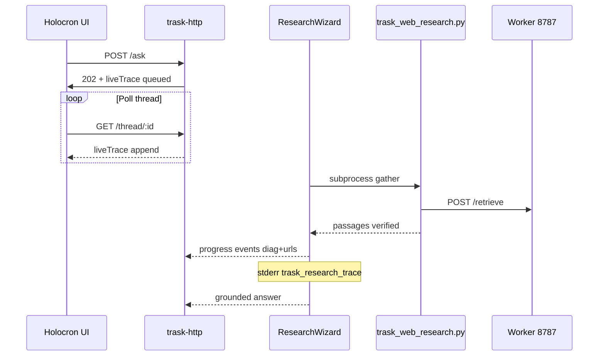

# Trask research quality bar v1 (transparency + finish gates)

## Summary

This plan completes the **holistic quality bar** from the transparency-first requirements doc: dense Holocron **Thought process**, **stderr log parity** for agents, a finished **passages + verified** evidence bus, **single URL-verify authority**, **tiered timeouts**, removal of the dead **lexical merge** path, and **trace-aware expert gates**. It builds on partial delivery in `docs/plans/2026-05-19-005-feat-trask-research-agent-2026-standards-plan.md` (hybrid retrieve, sufficiency/abstain, CI Worker :8787, stack restart policy) without re-litigating Vectorize or crawl replacement.

---

## Problem Frame

Operators and agents cannot trust Holocron/Discord answers when the pipeline is opaque: the UI may show “Thinking” while retrieve, verify, and compose fail silently or return **partial** answers with one weak citation. The quality-bar brainstorm makes **transparency the v1 gate** so accuracy and speed fixes are measurable. (see origin: `docs/brainstorms/2026-05-19-trask-research-quality-bar-requirements.md`)

---

## Requirements

- R1. **Holocron trace (origin R1):** Append-only `liveTrace` with absolute indexer URL, passage counts, per-URL retrieve lines, verify rejections, compose path, and timing — not generic-only gather heartbeats after retrieve completes.
- R2. **Log parity (origin R2):** Same facts on stderr/HTTP logs for `trask-http-server` and Python gather as in the UI (grep-friendly JSON).
- R3. **Accuracy floor (origin R3):** Citations only from retrieved passages; ≥2 on-topic sources when index supports; no invented URLs.
- R4. **Honest failure (origin R4):** Insufficient evidence → abstain/`failed` with reason in trace — not UI-default **partial** on thin answers.
- R5. **Speed visibility (origin R5):** Discord ≤90s; Holocron ~2 min warm; trace shows where time went.
- R6. **Shared pipeline (origin R6):** Worker **8787** only; surfaces differ in presentation only.
- R7. **Verification gates (origin R7):** Expert queries in `data/trask/eval/verification-queries.json` + `pnpm trask:faithfulness-eval` + `pnpm holocron:e2e` + browser MCP when available.

**Origin actors:** A1 Holocron researcher, A2 Discord `/ask` user, A3 operator/agent, A4 CI/release gate.

**Origin flows:** Ask → retrieve → grounded compose → surface display; operator debug via Thought process + logs.

**Origin acceptance examples:** AE1 TSLPatcher trace + ≥2 cites; AE2 saves trace explains second cite or abstain; AE3 failure classifiable from logs alone; AE4 expert + faithfulness green after changes.

---

## Scope Boundaries

- Full Holocron UI redesign or SSE streaming trace (deferred in origin).
- Discord full-length trace panel (brief answer + logs only).
- Vectorize migration, corpus re-crawl, public Pages outage recovery.
- New cross-encoder model selection beyond “CPU rerank on indexer” (defer exact model to implementation).

### Deferred to Follow-Up Work

- **Download trace JSON** from Holocron (origin deferred).
- **Wayback / urlhealth** distinction for hallucinated vs stale URLs (origin 005 deferred).
- **Production Worker auth** model (API key vs Access) — document only in this pass.

---

## Context & Research

### Relevant Code and Patterns

| Concern | Paths |
|---------|--------|
| Wizard + trace emit | `packages/trask/src/research-wizard.ts` (`emitResearchTraceLog`, `wrapResearchProgress`, `emitRetrieveSummary`) |
| Grounding / sufficiency | `packages/trask/src/grounded-evidence.ts` |
| Python gather | `scripts/trask_web_research.py` |
| HTTP liveTrace | `packages/trask-http/src/router.ts`, `packages/persistence/src/index.ts` |
| Holocron UI | `apps/holocron-web/src/components/Message.tsx`, `apps/holocron-web/src/App.tsx` |
| HTTP server wiring | `apps/trask-http-server/src/main.ts` (missing research log sink vs bot) |
| URL verify | `packages/trask/src/citation-url-verify.ts`, `scripts/lib/url-verify.mjs` |
| Expert data | `data/trask/eval/verification-queries.json`, `packages/trask-config/src/verification-queries.ts` |
| E2E | `apps/holocron-web/e2e/holocron-research.spec.ts` |
| CI | `.github/workflows/ci.yml` |
| Stack | `scripts/trask_live_stack.sh`, `AGENTS.md` |

### Prerequisites (from plan 005 — do not re-implement)

- Hybrid retrieve + RRF in indexer (005 U1).
- Sufficiency maps thin evidence to **failed** not partial (005 U3).
- CI uses Worker :8787 + faithfulness job (005 U5).
- KB authority + stack restart in `AGENTS.md` (005 U7).
- Partial: passages-only fallback when `report` empty; stderr `trask_research_trace`; queued `diag.indexer` (recent branch work).

### Institutional Learnings

- `docs/solutions/tooling-decisions/trask-crawl4ai-research-cutover-2026-05-19.md` — Worker-first, passages contract, restart stack before claiming done.
- `docs/brainstorms/2026-05-19-agent-stack-restart-policy-requirements.md` — mandatory `pnpm build` + `trask_live_stack.sh` after runtime edits.

### External References

- [Google sufficient context / abstain](https://research.google/blog/deeper-insights-into-retrieval-augmented-generation-the-role-of-sufficient-context/) — aligns with R4.
- [RAGAS Faithfulness](https://docs.ragas.io/en/latest/concepts/metrics/available_metrics/faithfulness/) — offline gate only; does not replace live trace gates.

---

## Key Technical Decisions

- **Quality bar doc is product authority; 005 is technical spine** — This plan traces R1–R7 to units; 005 remains reference for retrieve science and CI ladder. (see origin)
- **Trace is the debugging API** — Prefer extending `liveTrace` + structured stderr over new UI chrome. (see origin R1–R2)
- **Python owns verify once; Node trusts `verified: true`** — Eliminates double-HEAD latency and drift between `url-verify.mjs` and `citation-url-verify.ts`. (see origin R3, 005 U4)
- **Expert gates assert trace fields, not only answer text** — E2E must fail if `liveTrace` lacks indexer URL or passage count after complete. (see origin AE1–AE4)
- **Keep `partial` only when explicitly meaningful** — Default Holocron provenance strip to `grounded` | `failed` per brainstorm open question. (see origin R4)

---

## Open Questions

### Resolved During Planning

- **New plan vs extend 005?** Add **006** for quality-bar finish; 005 stays the 2026 standards umbrella; avoid renumbering 005 units.
- **E2E query source?** `holocron-research.spec.ts` loads **verification-queries.json** — gates and docs must say “expert” not only “golden five.”

### Deferred to Implementation

- Whether Discord shows a **one-line** footer (passage count + indexer host) in v1.
- Exact tier values for `TRASK_RESEARCH_GATHER_MS` / compose caps per surface.

---

## High-Level Technical Design

> Directional guidance for review, not implementation specification.

---

## Implementation Units

- U1. **Holocron trace density and retention**

**Goal:** Satisfy origin R1/AE1 — Thought process shows retrieve, verify, and compose facts after the query completes.

**Requirements:** R1, AE1, AE2

**Dependencies:** None (builds on existing `liveTrace` plumbing)

**Files:**
- Modify: `packages/trask/src/research-wizard.ts` (ensure `report`/`sources` phases emit `diag`; reduce generic-only heartbeats after retrieve summary)
- Modify: `packages/trask-http/src/router.ts` (persist all `diag`/`urls` on append; verify `mapTraskQueryRecord` exposes them)
- Modify: `apps/holocron-web/src/components/Message.tsx`, `apps/holocron-web/src/App.tsx`
- Test: `packages/trask-http/src/router.test.ts`, `apps/holocron-web/e2e/holocron-research.spec.ts`

**Approach:**
- After gather completes, every user-visible step should add diagnostic keys (`passages`, `index_miss`, `rejected_urls`, `compose_mode`, citation counts).
- Retain full `liveTrace` on completed records (no truncation on status transition).
- Tighten padding/layout only if it blocks readability of diag grid (already started).

**Test scenarios:**
- Covers AE1: completed TSLPatcher query — `liveTrace` contains phase with indexer URL and `passages` ≥ 2 in `diag` or `urls`.
- Covers AE2: saves query with one passage — trace shows low passage count; status `failed` not silent partial.
- Integration: poll `GET /api/trask/thread/:id` until complete; assert `liveTrace.length` ≥ 4 with ≥ 3 steps carrying `diag`.

**Verification:**
- Fresh thread on :4010; Thought process visible after answer; expert TSLPatcher matches AE1.

---

- U2. **Log parity: HTTP server + optional Python bridge**

**Goal:** Satisfy origin R2/AE3 — operators grep logs without opening Holocron.

**Requirements:** R2, AE3

**Dependencies:** U1 (same event shape)

**Files:**
- Modify: `apps/trask-http-server/src/main.ts` (wire `setTraskResearchLogSink` like `apps/trask-bot/src/main.ts`)
- Modify: `packages/trask/src/trask-research-subprocess.ts` (forward Python `trask.research` lines when verbose)
- Optional: `scripts/trask_web_research.py` (single-line JSON phase events on stderr)
- Modify: `docs/trask-ops.md`
- Test: `packages/trask/dist/research-wizard.test.js` (trace log disabled when env set)

**Approach:**
- Default: Node `trask_research_trace` JSON on stderr (already in wizard).
- HTTP server logs sink at INFO when `TRASK_RESEARCH_LOG_VERBOSE=1`.
- Optional v1.1: map Python `research_done` fields into one additional `liveTrace` row (only if needed for AE3 without log scraping).

**Test scenarios:**
- Happy path: one Holocron ask produces ≥ 3 `trask_research_trace` lines in server log.
- Covers AE3: given log excerpt, classify failure as retrieve vs verify vs compose.

**Verification:**
- Run ask via API; `grep trask_research_trace` on server output shows gather + retrieve summary.

---

- U3. **Evidence bus: `verified` metadata and Node trust**

**Goal:** Complete passages-only contract and enable single verify authority (005 U2 + U4).

**Requirements:** R3, R6

**Dependencies:** U1

**Files:**
- Modify: `scripts/trask_web_research.py` (`_verify_passages`, passage DTO)
- Modify: `packages/trask/src/trask-research-subprocess.ts`, `packages/trask/src/research-wizard.ts`
- Modify: `packages/trask/src/citation-url-verify.ts`, `packages/trask/src/grounded-evidence.ts`
- Test: `packages/trask/src/grounded-evidence.test.ts`, `packages/trask/src/research-wizard.test.ts`

**Approach:**
- Python sets `verified: true` on surviving passages; log rejects to stderr.
- Node skips re-HEAD when all cited passages are verified unless `TRASK_FORCE_URL_VERIFY=1`.
- Demote narrative `report` to debug (`TRASK_RESEARCH_DEBUG_REPORT=1` or log-only).

**Test scenarios:**
- Happy path: compose cites only URLs present in passage list.
- Error path: fixture 404 URL dropped before compose.
- Integration: `pnpm trask:faithfulness-eval` passes.

**Verification:**
- No answer URL outside passage set for expert TSLPatcher run.

---

- U4. **Tiered timeouts and visible timeout reasons**

**Goal:** Satisfy origin R5 and 005 U6 — budgets match Discord 90s and Holocron UX.

**Requirements:** R5

**Dependencies:** U3

**Files:**
- Modify: `packages/config/src/index.ts`, `data/trask/retrieval.defaults.json`
- Modify: `packages/trask/src/trask-research-subprocess.ts`, `packages/trask/src/research-wizard.ts`
- Modify: `apps/trask-bot/src/main.ts`, `docs/knowledgebase/50-execution/trask-configuration-env-map.md`
- Test: `packages/trask-config/src/retrieval-defaults.test.ts`, `packages/config/src/index.test.ts`

**Approach:**
- Split gather vs compose ceilings; surface-specific caps (Discord stricter than batch eval).
- On timeout, append `liveTrace` compose/gather failure with `diag.elapsed_ms` and limit name.

**Test scenarios:**
- Edge case: artificially low gather cap → user-visible failure message within Discord budget.
- Happy path: warm expert query completes under Holocron e2e timeout (~200s UI wait).

**Verification:**
- `pnpm verify:trask-discord` completes under 90s when indexer warm (or documents skip).

---

- U5. **Remove dead lexical merge from live Q&A**

**Goal:** Satisfy origin R6 / 005 U8 — Chroma-only evidence for grounded answers.

**Requirements:** R6

**Dependencies:** U3

**Files:**
- Modify: `packages/trask/src/research-wizard.ts`
- Modify: `apps/trask-http-server/src/main.ts`, `apps/trask-bot/src/main.ts` (stop injecting unused `localSearchProvider` or gate behind `TRASK_LEXICAL_DEV=1`)
- Modify: `docs/knowledgebase/10-architecture-runtime/trask-synthesis-and-chunk-retrieval.md`
- Test: `packages/trask/dist/research-wizard.test.js`

**Approach:**
- Remove or dev-flag `searchLocalKnowledge`; document ingest-only role for `FileChunkStore`.

**Test scenarios:**
- Happy path: citations reference only Worker retrieve URLs.
- Integration: grep/runtime confirm no `searchLocalKnowledge` on hot path in grounded mode.

**Verification:**
- Repo search shows no live call from `answerQuestion` / `answerForSurface` without dev flag.

---

- U6. **Trace-aware expert verification gates**

**Goal:** Satisfy origin R7 and AE4 — CI and agents block trace regressions.

**Requirements:** R7, AE4

**Dependencies:** U1, U2, U3

**Files:**
- Modify: `apps/holocron-web/e2e/holocron-research.spec.ts`
- Modify: `scripts/verify_trask_discord_live.mjs` (optional trace footer assertion)
- Modify: `AGENTS.md` (align “five queries” wording with verification-queries)
- Test: `apps/holocron-web/e2e/holocron-research.spec.ts`

**Approach:**
- After each expert query: assert `liveTrace` includes indexer host, passage-related `diag` or `urls`, and `groundingStatus` grounded or failed (not missing).
- Keep faithfulness + config drift in CI unchanged.

**Test scenarios:**
- Covers AE4: full e2e expert list passes with trace assertions.
- Error path: deliberately broken indexer URL in test env → trace shows failure class (manual or integration fixture).

**Verification:**
- `pnpm holocron:e2e` green; browser MCP all expert queries when available per `AGENTS.md`.

---

- U7. **Holocron provenance UX: grounded vs failed**

**Goal:** Close brainstorm open question on **partial** — align UI with R4.

**Requirements:** R4

**Dependencies:** U1, U3

**Files:**
- Modify: `apps/holocron-web/src/components/Message.tsx`
- Modify: `apps/holocron-web/src/lib/types.ts`
- Test: extend holocron e2e or component test if present

**Approach:**
- When `groundingStatus` is absent, infer from citation count + status — do not default to **partial** for complete-looking answers.
- Show abstain/degrade copy when `failed`.

**Test scenarios:**
- Covers AE2: single-citation saves query shows **failed** provenance, not partial badge.
- Happy path: grounded answer shows grounded badge only.

**Verification:**
- Browser check on saves expert query (fresh thread).

---

## System-Wide Impact

- **Interaction graph:** `POST /ask` 202 → background wizard → `appendLiveTrace` → thread poll; Discord uses same wizard without full trace UI.
- **Error propagation:** Timeout and verify failures must appear in both `liveTrace` and stderr before final record write.
- **API surface parity:** Holocron, Discord bot, CLI subprocess share wizard; only Holocron exposes full trace.
- **Integration coverage:** E2E trace assertions required; faithfulness alone insufficient.
- **Unchanged invariants:** Worker-only retrieve URL; approved-host allowlist; Discord ≤5 lines + inline links.

---

## Risks & Dependencies

| Risk | Mitigation |
|------|------------|
| Verbose trace overwhelms Discord message size | Keep Discord brief; logs carry detail |
| Double-verify removal hides broken URLs | Faithfulness fixtures + Python verify stays strict |
| E2E flakiness on trace timing | Poll until `status !== pending`; generous timeout |
| 005 and 006 overlap confuses agents | This plan references 005 prerequisites explicitly |

---

## Documentation / Operational Notes

- Operator path: `bash scripts/trask_live_stack.sh` after any unit touching runtime.
- Env: `TRASK_RESEARCH_TRACE_LOG=0` disables Node trace JSON; `TRASK_RESEARCH_LOG_VERBOSE=1` forwards Python DEBUG on HTTP server.
- Mandatory ship: `pnpm trask:faithfulness-eval`, `pnpm holocron:e2e`, expert browser pass, `pnpm verify:trask-discord` when token available.

---

## Sources & References

- **Origin document:** [docs/brainstorms/2026-05-19-trask-research-quality-bar-requirements.md](docs/brainstorms/2026-05-19-trask-research-quality-bar-requirements.md)
- **Related plan:** [docs/plans/2026-05-19-005-feat-trask-research-agent-2026-standards-plan.md](docs/plans/2026-05-19-005-feat-trask-research-agent-2026-standards-plan.md)
- **KB:** `docs/knowledgebase/10-architecture-runtime/trask-research-agent-2026-standards.md`
- **Solution:** `docs/solutions/tooling-decisions/trask-crawl4ai-research-cutover-2026-05-19.md`
- **E2E:** `apps/holocron-web/e2e/holocron-research.spec.ts`
- **Expert queries:** `data/trask/eval/verification-queries.json`
