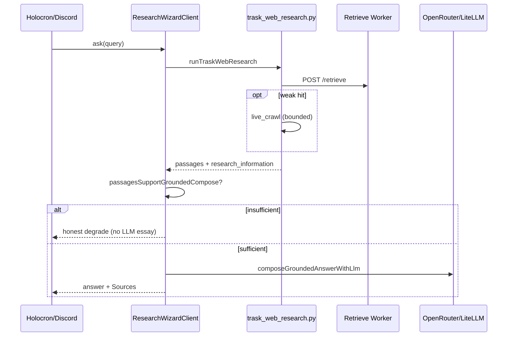

# Trask RAG incremental hardening

## Summary

Implement the next vertical slice of the owned **crawl → embed → retrieve → cite → compose** stack: **wire passage sufficiency before LLM compose**, restore **doc authority** (single product policy path), **Holocron e2e spec**, and **retrieve observability** in traces. Defer BM25/heading chunking, batch crawl CLI, and HF baked-Chroma deploy to follow-up units. LLM policy stays **OpenRouter `:free` + `vendor/llm_fallbacks`** — not local Ollama (see origin).

---

## Problem Frame

Feasibility and coherence reviews found the architecture sound but **contract drift**: sufficiency helpers existed without compose gating, operator docs described DDG-first research, plan 005 claimed U3 landed while code did not call the gate, and Holocron e2e was deleted while `AGENTS.md` still mandated it. Users risk fluent wrong answers when retrieve is thin.

---

## Requirements

- R1. Index-first corpus authority (origin R1–R2)
- R6. Sufficiency gate before compose (origin R6, AE1)
- R8–R12. OpenRouter free + llm_fallbacks compose (origin)
- R4. Retrieve/live-crawl observability in diagnostics (origin R4)
- R14. Local repro via `trask_live_stack.sh` (origin)
- R16. Eval ladder: faithfulness + e2e + Discord verify (origin)

**Origin actors:** A1 modder, A2 Discord member, A3 operator, A4 compose LLM  
**Origin flows:** F1 happy path, F2 live-crawl recovery, F3 honest degrade, F4 LLM fallbacks  
**Origin acceptance examples:** AE1–AE4

---

## Scope Boundaries

- Full BM25 sparse index or cross-encoder rerank (defer U6)
- Batch catalog crawl operator CLI (defer U5)
- HF supervisor + baked Chroma volume (defer U7)
- Replatform to RAGFlow/Onyx/GPT-Researcher
- Local Ollama as default compose
- Restoring full Trask unit test suite (minimal gates only)

### Deferred to Follow-Up Work

- **U5 Batch crawl CLI:** `trask-indexer crawl-seeds` one-shot over allowlist
- **U6 Retrieve quality:** true BM25 + heading-aware chunking
- **U7 HF deploy:** supervisor entrypoint + baked Chroma in image

---

## Context & Research

### Relevant Code and Patterns

| Layer | Path |
|-------|------|
| Sufficiency / compose | `packages/trask/src/grounded-evidence.ts`, `research-wizard.ts` |
| Gather | `scripts/trask_web_research.py` |
| LLM config | `packages/config/src/index.ts`, `vendor/llm_fallbacks/` |
| Policy data | `data/trask/eval/verification-queries.json`, `golden-queries.json` |
| E2e | `apps/holocron-web/e2e/holocron-research.spec.ts` |
| Ops | `scripts/trask_live_stack.sh`, `docs/trask-research-backends.md` |

### Institutional Learnings

- `docs/solutions/tooling-decisions/trask-crawl4ai-research-cutover-2026-05-19.md` (refreshed 2026-05-19)

### External References

- [Google sufficient context (abstain when thin)](https://research.google/blog/deeper-insights-into-retrieval-augmented-generation-the-role-of-sufficient-context/)

---

## Key Technical Decisions

- **R6 enforcement:** `passagesSupportGroundedCompose()` gates `tryGroundedCompose` and blocks `rewriteForDiscord` when grounded mode is on (see origin R6).
- **QA escape hatch:** `TRASK_QA_GROUNDING=1` lowers min distinct URLs to 1 — dev/seed only, not production default.
- **Doc authority:** Product policy → `docs/brainstorms/trask-self-hosted-research-pipeline-requirements.md`; ops → `docs/trask-research-backends.md` + solutions cutover doc; plan 005 → superseded execution history.
- **E2e queries:** Browser gate uses `verification-queries.json` (expert phrasing); CLI/fixtures use `golden-queries.json`.

---

## Open Questions

### Resolved During Planning

- **1-URL Holocron escape:** Retired for production; available only via `TRASK_QA_GROUNDING=1`.
- **Local LLM:** Rejected; OpenRouter free + llm_fallbacks remains canonical.

### Deferred to Implementation

- **BM25 vs lexical RRF:** Accept lexical for v1 or invest in sparse index — decide during U6.
- **HF deploy target:** Baked Chroma in-image vs external Worker + VPS indexer.

---

## High-Level Technical Design

> Directional guidance for review, not implementation specification.

---

## Implementation Units

- U1. **Passage sufficiency gate (R6)**

**Goal:** Block LLM compose when retrieved passages cannot support ≥2-source grounded answers.

**Requirements:** R6, AE1, F3

**Dependencies:** None

**Files:**
- Modify: `packages/trask/src/grounded-evidence.ts`
- Modify: `packages/trask/src/research-wizard.ts`

**Approach:** Export `passagesSupportGroundedCompose`; call before claim extraction in `tryGroundedCompose`; gate `rewriteForDiscord` when grounded compose enabled; restrict 1-URL Holocron escape to `TRASK_QA_GROUNDING=1`.

**Test scenarios:**
- Edge case: 1 https passage + anchor match → compose returns null (honest degrade) without `TRASK_QA_GROUNDING`
- Happy path: 2+ distinct https hosts with anchor overlap → compose proceeds
- Error path: synthesis failure path does not call rewrite when passages insufficient

**Verification:** `pnpm trask:faithfulness-eval`; manual CLI query with thin retrieve returns degrade not essay.

**Status:** Landed in branch work (2026-05-19 session).

---

- U2. **Retrieve observability in traces (R4)**

**Goal:** Surface live crawl and passage counts in Holocron `liveTrace` diagnostics.

**Requirements:** R4, F2

**Dependencies:** None

**Files:**
- Modify: `packages/trask/src/trask-research-subprocess.ts`
- Modify: `packages/trask/src/research-wizard.ts`

**Approach:** Extend `research_information` types with `live_crawl_attempted`, `live_crawl_passages`; add to `diagFromResearchPayload`.

**Test scenarios:**
- Integration: after live crawl recovery, trace includes `live_crawl_passages` > 0

**Verification:** Holocron thread poll shows diag fields after expert query.

**Status:** Partially landed (types + diag); confirm Python→Node mapping on live stack.

---

- U3. **Doc authority consolidation**

**Goal:** One coherent operator + policy story; remove DDG-first and Ollama contradictions.

**Requirements:** R14, origin scope

**Dependencies:** None

**Files:**
- Modify: `docs/trask-research-backends.md`, `docs/plans/2026-05-19-005-*.md`, `AGENTS.md`, `STRATEGY.md`, `.env.local.example`
- Modify: `docs/brainstorms/trask-self-hosted-research-pipeline-requirements.md` (flow tags, R6/R16)
- Modify: `docs/solutions/tooling-decisions/trask-crawl4ai-research-cutover-2026-05-19.md`

**Verification:** Coherence review P0 items resolved on read-through.

**Status:** Landed (2026-05-19 session).

---

- U4. **Restore Holocron e2e spec (R16)**

**Goal:** `pnpm holocron:e2e` runs expert queries against live stack.

**Requirements:** R16, origin F1

**Dependencies:** U3 (doc alignment)

**Files:**
- Restore: `apps/holocron-web/e2e/holocron-research.spec.ts`

**Approach:** Restore from git history; uses `verificationQueriesForSurface('holocron')`.

**Test scenarios:**
- Happy path: five serial tests complete with ≥2 https citations each (when stack + OPENROUTER_API_KEY available)

**Verification:** `pnpm holocron:e2e` with `HOLOCRON_REUSE_SERVER=1` after `trask_live_stack.sh`.

**Status:** Spec file restored; full green run requires live stack + API keys.

---

- U5. **Batch crawl operator CLI (R1)** — deferred

**Goal:** One-shot crawl of allowlist seeds into Chroma (recovery-only live crawl at query time).

**Requirements:** R1, AE3

**Files:** `infra/trask-indexer/trask_indexer/cli.py`, new command `crawl-seeds`

---

- U6. **Hybrid retrieve hardening (R3)** — deferred

**Goal:** True BM25 or Chroma sparse + heading-aware chunking.

**Files:** `infra/trask-indexer/trask_indexer/chroma_store.py`, `chunk.py`

---

- U7. **HF deploy parity (R15)** — deferred

**Goal:** Supervisor starts indexer + HTTP or document external retrieve dependency.

**Files:** `infra/trask-http-public/Dockerfile`, pack scripts

---

## System-Wide Impact

- **Interaction graph:** Holocron and Discord share `ResearchWizardClient`; sufficiency gate affects both surfaces.
- **Error propagation:** Thin evidence → `sourceOnlyFallbackAnswer` / failed grounding — not partial fluent essays.
- **API surface parity:** `pazaak-bot` still uses legacy `WebResearchClient` — out of scope unless explicitly unified (origin R13 partial).
- **Unchanged invariants:** Worker-only retrieve URL (:8787), allowlist citation contract.

---

## Risks & Dependencies

| Risk | Mitigation |
|------|------------|
| QA seed queries fail strict R6 | Use `TRASK_QA_GROUNDING=1` locally only; expand batch crawl (U5) |
| E2e flaky without OPENROUTER_API_KEY | Document required env; CI secrets |
| Free-tier rate limits | llm_fallbacks chain + LiteLLM proxy (origin R9) |

---

## Documentation / Operational Notes

- Run `bash scripts/trask_live_stack.sh` after any Trask runtime change (`AGENTS.md`).
- Full free LiteLLM catalog: `TRASK_LITELLM_CONFIG=vendor/llm_fallbacks/configs/litellm_config_free.yaml bash scripts/trask_litellm_proxy.sh`

---

## Sources & References

- **Origin document:** [docs/brainstorms/trask-self-hosted-research-pipeline-requirements.md](../brainstorms/trask-self-hosted-research-pipeline-requirements.md)
- **Solutions:** [docs/solutions/tooling-decisions/trask-crawl4ai-research-cutover-2026-05-19.md](../solutions/tooling-decisions/trask-crawl4ai-research-cutover-2026-05-19.md)
- **Superseded plan:** [docs/plans/2026-05-19-005-feat-trask-research-agent-2026-standards-plan.md](./2026-05-19-005-feat-trask-research-agent-2026-standards-plan.md)
